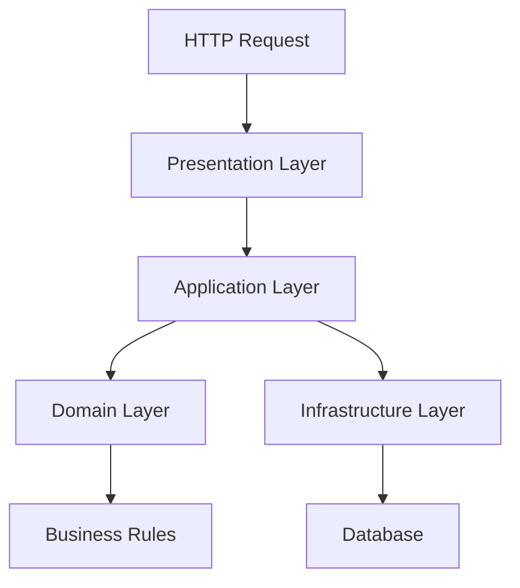

# DDD Architecture Documentation

## 📋 Umumiy Tuzilma

Loyihan **Domain-Driven Design (DDD)** arxitekturasiga asoslangan bo'lib, quyidagi asosiy layerlarga bo'lingan:

```
src/
├── application/    # Application Layer
├─�� core/           # Shared Kernel
├── di/             # Dependency Injection
├── domain/         # Domain Layer
├── infrastructure/ # Infrastructure Layer
├── presentation/   # Presentation Layer
└── utils/          # Utilities
```

## 🏗 Layerlar Tavsifi

### 1. Domain Layer (`src/domain/`)
**Maqsad**: Biznes logikasi va qoidalarini saqlaydi

#### 📁 Struktura:
- **`entity/`**: Biznes ob'ektlari (Business Entities)
- **`repository/`**: Repository interfacelari (Abstractions)
- **`services/`**: Domain servicelari

#### 📄 Asosiy Fayllar:
- `entity/user_entity.py`: User biznes ob'ekti
- `entity/category_entity.py`: Category biznes ob'ekti
- `repository/user_repository.py`: User repository interface
- `services/security/token_repository.py`: Token service interface

**Vazifasi**:
- Biznes qoidalarini implement qilish
- Entity lifecycle management
- Domain servicelari (complex business logic)

### 2. Application Layer (`src/application/`)
**Maqsad**: Use caseler va application logic

#### 📁 Struktura:
- **`dto/`**: Data Transfer Objects
- **`usecases/`**: Application use cases
- **`mappers/`**: Domain va DTO orasidagi mapping
- **`services/`**: Application servicelari

#### 📄 Asosiy Fayllar:
- `usecases/auth_usecase.py`: Authentication use caselari
- `dto/auth_dto.py`: Authentication DTOlari
- `mappers/auth_mapper.py`: Auth mapping logikasi

**Vazifasi**:
- Biznes scenariylarini orchestrate qilish
- External layerlar bilan domain orasidagi adapter
- Transaction management

### 3. Infrastructure Layer (`src/infrastructure/`)
**Maqsad**: Tashqi sistemlar bilan integratsiya

#### 📁 Struktura:
- **`persistence/`**: Database operations
- **`security/`**: Security implementations
- **`gateway/`**: External service integrations

#### 📄 Asosiy Fayllar:
- `persistence/repository/user_repository_impl.py`: User repository implementatsiyasi
- `security/jwt_auth_service.py`: JWT token service implementatsiyasi
- `persistence/models/`: SQLAlchemy modellari
- `persistence/migrations/`: Database migrationlari

**Vazifasi**:
- Database operations
- External API calls
- File system operations
- Third-party integrations

### 4. Presentation Layer (`src/presentation/`)
**Maqsad**: User interface va API endpoints

#### 📁 Struktura:
- **`routers/`**: FastAPI route handlerlari
- **`middlewares/`**: HTTP middlewares
- **`mappers/`**: Request/Response mapping
- **`admin/`**: Admin panel

#### 📄 Asosiy Fayllar:
- `routers/auth/`: Authentication endpointlari
- `middlewares/jwt_auth_middleware.py`: JWT authentication middleware
- `app.py`: FastAPI application konfiguratsiyasi

**Vazifasi**:
- HTTP request/response handling
- Input validation
- Authentication va authorization
- API documentation

### 5. Core Layer (`src/core/`)
**Maqsad**: Shared utilities va configurations

#### 📄 Asosiy Fayllar:
- `settings.py`: Application konfiguratsiyasi
- `exceptions.py`: Base exception classes
- `response/`: Response formatting utilities

**Vazifasi**:
- Application configuration
- Shared exceptions
- Common utilities

### 6. DI Layer (`src/di/`)
**Maqsad**: Dependency injection configuration

#### 📄 Asosiy Fayllar:
- `__init__.py`: Main container
- `repository_module.py`: Repository bindings

**Vazifasi**:
- Service registration
- Dependency resolution
- Inversion of Control

## 🔄 Data Flow



### Request Flow:
1. **HTTP Request** → Presentation Layer (FastAPI router)
2. **Router** → Application Layer (Use Case)
3. **Use Case** → Domain Layer (Entity/Service)
4. **Use Case** → Infrastructure Layer (Repository)
5. **Repository** → Database
6. **Response** ← Reverse order

## 📊 Dependency Rules

### ✅ Allowed Dependencies:
- **Domain** → Hech kimga bog'liq emas
- **Application** → Domain
- **Infrastructure** → Domain, Application
- **Presentation** → Application, Domain

### ❌ Forbidden Dependencies:
- Domain → Application/Infrastructure/Presentation
- Application → Infrastructure/Presentation

## 🏛 Patterns Used

### 1. Repository Pattern
- **Interface**: `domain/repository/`
- **Implementation**: `infrastructure/persistence/repository/`

### 2. Use Case Pattern
- **Location**: `application/usecases/`
- **Purpose**: Biznes scenariylarini implement qilish

### 3. DTO Pattern
- **Location**: `application/dto/`
- **Purpose**: Layer orasidagi data transfer

### 4. Mapper Pattern
- **Locations**: `application/mappers/`, `presentation/mappers/`
- **Purpose**: Object transformation

### 5. Dependency Injection
- **Location**: `di/`
- **Purpose**: Loose coupling

## 🔧 Configuration Management

### Environment Variables:
```bash
# Database
POSTGRES_HOST=localhost
POSTGRES_DB=auth_db
POSTGRES_USER=auth_db_user
POSTGRES_PASSWORD=auth_db_password

# JWT
JWT_ALGORITHM=HS256
SECRET_KEY=your-secret-key

# Application
DEBUG=True
ENVIRONMENT=DEV
```

### Settings Management:
- **File**: `core/settings.py`
- **Pattern**: Pydantic BaseSettings
- **Environment**: `.env` file support

## 🚀 Best Practices Implemented

1. **Separation of Concerns**: Har bir layer o'z vazifasini bajaradi
2. **Dependency Inversion**: High-level modullar low-level modullarga bog'liq emas
3. **Single Responsibility**: Har bir class bitta vazifani bajaradi
4. **Interface Segregation**: Kichik, specific interfacelar
5. **Open/Closed Principle**: Extension uchun ochiq, modification uchun yopiq

## 📝 Migration Management

### Alembic Configuration:
- **Location**: `infrastructure/persistence/migrations/`
- **Commands**: 
  ```bash
  python manage.py makemigrations -m "description"
  python manage.py migrate
  ```

### Model-First Approach:
1. SQLAlchemy model yaratish
2. Alembic migration generatsiya qilish
3. Migration apply qilish

## 🔐 Security Implementation

### JWT Authentication:
- **Service**: `infrastructure/security/jwt_auth_service.py`
- **Middleware**: `presentation/middlewares/jwt_auth_middleware.py`
- **Features**: Token generation, validation, password hashing

### Password Security:
- **Hashing**: bcrypt
- **Validation**: Pydantic validators
- **Storage**: Hashed passwords only

## 📈 Scalability Features

1. **Async/Await**: Database operations
2. **Connection Pooling**: SQLAlchemy async engine
3. **Dependency Injection**: Loose coupling
4. **Caching Ready**: Repository pattern supports caching
5. **Microservice Ready**: Clear boundaries between layers

## 🧪 Testing Strategy

### Test Structure (Tavsiya):
```
tests/
├── unit/
│   ├── domain/
│   ├── application/
│   └── infrastructure/
├── integration/
└── e2e/
```

### Mocking Strategy:
- **Domain**: Pure unit tests
- **Application**: Mock repository interfaces
- **Infrastructure**: Integration tests with test database

## 📚 Documentation Standards

1. **Docstrings**: Google style
2. **Type Hints**: Har joyda ishlatilgan
3. **API Documentation**: FastAPI auto-generated
4. **Architecture Documentation**: Ushbu fayl

---

## 🛠️ Development Guide

### Local Setup

#### 1. Clone and Setup
```bash
git clone <repository-url>
cd FinanceAI

# Create virtual environment
python -m venv venv
source venv/bin/activate  # Linux/Mac
# or
venv\Scripts\activate  # Windows

# Install dependencies
pip install -r requirements.txt

# Copy environment file
cp env/.env.example env/.env
# Edit env/.env with your database credentials
```

#### 2. Database Setup
```bash
# Make sure PostgreSQL is running
# Create database (if not exists)
createdb finance_db

# Run migrations
python src/manage.py migrate
```

#### 3. Run Development Server
```bash
# From project root
cd src
python manage.py runserver

# Or directly with uvicorn
uvicorn main:app --reload --host 0.0.0.0 --port 8000
```

### Docker Setup

#### 1. Build and Run with Docker Compose
```bash
# From project root
cd docker

# Build and start containers
docker-compose up --build

# Run in detached mode
docker-compose up -d

# View logs
docker-compose logs -f web

# Stop containers
docker-compose down
```

**Note**: Docker entrypoint automatically runs migrations on startup!

### Migration Commands

#### Create Migration
```bash
# From project root
python src/manage.py makemigrations -m "description of changes"
```

#### Apply Migrations
```bash
# From project root
python src/manage.py migrate
```

#### Manual Alembic (if needed)
```bash
cd src/infrastructure/persistence/migrations
export PYTHONPATH=/path/to/project/src

# Create migration
alembic revision --autogenerate -m "description"

# Apply migrations
alembic upgrade head

# Rollback
alembic downgrade -1
```

### API Documentation

Once the server is running:
- **Swagger UI**: http://localhost:8000/docs
- **ReDoc**: http://localhost:8000/redoc
- **OpenAPI JSON**: http://localhost:8000/openapi.json

### Health Check

```bash
curl http://localhost:8000/health
```

---

## ⚙️ Architecture Improvements Applied

### 1. **Session Management** ✅
- `DatabaseSessionManager` - Singleton pattern for connection pool
- `get_db()` dependency - Automatic session lifecycle management
- Repositories use `flush()` instead of `commit()` - Controlled by FastAPI context

### 2. **Memory Leak Prevention** ✅
- Repositories are **NOT singleton** - New instance per request
- Each request gets fresh `AsyncSession`
- Session automatically closed after request (via `get_db()`)

### 3. **Migration System** ✅
- `manage.py` with proper working directory
- Docker entrypoint auto-runs migrations
- PYTHONPATH correctly set for imports

### 4. **Error Handling** ✅
- Global exception handler middleware
- Structured logging with `structlog`
- Layer-specific exceptions with proper HTTP status mapping
- Detailed error responses with `ApiResponse`

### 5. **Docker Optimization** ✅
- Entrypoint script handles:
  - PostgreSQL readiness check
  - Automatic migration execution
  - Application startup
- Health check for PostgreSQL in docker-compose
- Proper service dependency management

---

## 🐛 Troubleshooting

### Migration Issues

**Problem**: `ModuleNotFoundError` when running migrations
```bash
# Solution: Set PYTHONPATH
export PYTHONPATH=/path/to/project/src
# Or use manage.py which sets it automatically
python src/manage.py migrate
```

**Problem**: Migrations not applied in Docker
```bash
# Check entrypoint logs
docker-compose logs web

# Manual migration in container
docker exec -it finance_app bash
cd /app/src/infrastructure/persistence/migrations
export PYTHONPATH=/app/src
alembic upgrade head
```

### Database Connection Issues

**Problem**: Cannot connect to database
```bash
# Check PostgreSQL is running
docker-compose ps

# Check environment variables
docker-compose exec web env | grep POSTGRES

# Test connection
docker-compose exec postgres psql -U postgres -d finance_db -c "SELECT 1"
```

### Memory Leak / Session Issues

**Problem**: Too many database connections
- Check that repositories are NOT singleton in `di/repository_module.py`
- Ensure `get_db()` is used in FastAPI routes
- Verify session is properly closed (should be automatic)

---

## 📖 Additional Resources

- [FastAPI Documentation](https://fastapi.tiangolo.com/)
- [SQLAlchemy Async](https://docs.sqlalchemy.org/en/20/orm/extensions/asyncio.html)
- [Alembic Tutorial](https://alembic.sqlalchemy.org/en/latest/tutorial.html)
- [Injector Documentation](https://injector.readthedocs.io/)
- [Clean Architecture](https://blog.cleancoder.com/uncle-bob/2012/08/13/the-clean-architecture.html)